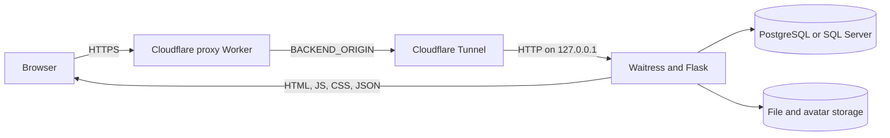

# MWL 2.0 — Developer Design and Operations Guide

This document explains how the application is assembled, where to edit each user-facing element, how the HTTP API behaves, and how to run or deploy the system.

## 1. System overview

MWL 2.0 is a same-origin web application:

- **Frontend:** React 19, TypeScript, Vite, Mantine, React Router, and TanStack Query in `frontend/`.
- **Backend:** Flask in `app/`, started by `app.py` for development or Waitress in production.
- **Database:** PostgreSQL or Microsoft SQL Server, selected by `DB_ENGINE` in `.env` and abstracted by `db.py`.
- **Files:** Metadata is stored in the database; file and avatar blobs are stored on the backend filesystem.
- **Public ingress:** a Cloudflare Worker proxies a stable public URL to a Cloudflare Tunnel that reaches the Windows backend host.

### Production request flow



The React application is not independently hosted in the current production path. `npm run build` writes hashed JS/CSS into `static/assets/` and copies the generated HTML shell to `templates/index.html`, `templates/login.html`, and `templates/reset_password.html`. Flask serves those files, so the browser, session cookie, SPA, and `/api/*` requests remain on one origin.

## 2. Repository map

| Path | Responsibility |
| --- | --- |
| `frontend/src/` | React source; edit the UI here. |
| `frontend/src/pages/` | Route-level screens. |
| `frontend/src/components/` | Shared visual and feature components. |
| `frontend/src/api/` | Typed frontend API calls and error handling. |
| `frontend/src/types/api.ts` | API response and request contracts used by TypeScript. |
| `frontend/src/styles.css` | Global design tokens, layout, component classes, breakpoints, and motion. |
| `frontend/src/theme.ts` | Mantine defaults: color, radius, fonts, and component defaults. |
| `frontend/vite.config.ts` | Build output, Cloudflare Vite integration, and local API proxy. |
| `frontend/postbuild.mjs` | Copies the Vite HTML shell to Flask templates. |
| `app/` | Flask blueprints grouped by domain. |
| `app/__init__.py` | Flask construction, environment-backed settings, CSRF origin validation, and blueprint registration. |
| `db.py` | Dual PostgreSQL/SQL Server connection and SQL compatibility layer. |
| `postgres_init_db.sql` | PostgreSQL schema applied by `db.init_db()`. |
| `templates/` | Generated SPA shells; do not edit by hand. |
| `static/assets/` | Generated hashed frontend assets; do not edit by hand. |
| `worker/src/index.js` | Stable public reverse-proxy Worker. |
| `worker/wrangler.jsonc` | Proxy Worker deployment configuration. |
| `worker/service/` | Windows/NSSM services for Waitress and the tunnel. |
| `tests/` | Backend tests. |

## 3. How to edit UI elements

### 3.1 Source-versus-generated rule

Edit files under `frontend/src/` and rebuild. Do **not** hand-edit `static/assets/*` or the three generated files in `templates/`; the next frontend build will replace them.

After a UI change:

```powershell
cd frontend
npm run typecheck
npm run build
```

The build performs three operations:

1. Type-checks the TypeScript project.
2. Writes hashed assets to `../static/assets/`.
3. Runs `postbuild.mjs`, which copies the HTML shell into `../templates/` and removes the unauthenticated `static/index.html` copy.

### 3.2 Global elements

| Element to change | Edit here | Notes |
| --- | --- | --- |
| Browser title, language, viewport metadata | `frontend/index.html` | The generated template copies inherit these values. |
| Application route or page guard | `frontend/src/App.tsx` | Add the route here and add its navigation item separately. |
| Top bar, logo, product name, user chip, sidebar, and navigation | `frontend/src/components/AppShellLayout.tsx` | `navItems` controls the normal navigation. Summary and Settings have role-dependent rendering. |
| Shared page eyebrow, title, description, breadcrumb, and action area | `frontend/src/components/PageHeader.tsx` | The actual text values are passed by each page. |
| Brand colors, semantic status colors, shadows, spacing, breakpoints, and animation | `frontend/src/styles.css` | Start with the `:root` custom properties. Preserve the reduced-motion rules. |
| Mantine primary color, typography, radii, and default component props | `frontend/src/theme.ts` | Keep the Thai-capable fallback fonts in the stack. |
| Login/register/reset visual frame and animated background | `frontend/src/components/AuthLayout.tsx` and the `.auth-*` rules in `styles.css` | Brand text is in `AuthBrandHeader`; particles are in `PARTICLES`. |
| Auth state and login/logout behavior | `frontend/src/auth/AuthProvider.tsx` | The session is discovered through `GET /api/me`. |
| Authenticated/elevated route redirects | `frontend/src/auth/RequireAuth.tsx` | API authorization must still be enforced on the backend. |
| Selected employee state | `frontend/src/workspace/WorkspaceContext.tsx` | Elevated users may switch employees; Staff is forced to its own EmployeeID. |
| Employee picker | `frontend/src/components/MemberPicker.tsx` | Search, identity display, and selection UI. |
| Month selector | `frontend/src/components/PeriodSelect.tsx` | Previous/next buttons and month popover. |
| Toast messages | `frontend/src/utils/notify.ts` | API errors are normalized by `frontend/src/api/http.ts`. |
| API cache/retry timing | `frontend/src/api/queryClient.ts` | Default stale time is five minutes. Mutations do not retry. |

### 3.3 Page and feature elements

| URL | Main file | Elements and supporting files | API client |
| --- | --- | --- | --- |
| `/login` | `pages/LoginPage.tsx` | Sign-in form, lockout countdown, and forgot-password flow; shared frame in `components/AuthLayout.tsx`. | `api/auth.ts` |
| `/register` | `pages/RegisterPage.tsx` | Employee lookup, account request form, and submitted state. | `api/auth.ts` |
| `/reset-password` | `pages/ResetPasswordPage.tsx` | Token validation and new-password form. | `api/auth.ts` |
| `/` | `pages/DashboardPage.tsx` | Personal/team toggle, metrics, charts, recent activity, and month breakdown. Cards and team views live in `MetricCard.tsx`, `TeamOverview.tsx`, and `MemberCard.tsx`. | `api/worklogs.ts`, employee/skill/project clients |
| `/worklog` | `pages/WorklogPage.tsx` | Toolbar, table/calendar modes, create/edit/delete flow. Calendar and editor live in `WorklogCalendar.tsx` and `WorklogEntryPanel.tsx`. | `api/worklogs.ts`, `api/projects.ts`, `api/settings.ts` |
| `/allowance` | `pages/AllowancePage.tsx` | Allowance table and add/edit modal. The backend derives normal/special day type. | `api/allowance.ts`, `api/projects.ts` |
| `/summary` | `pages/SummaryPage.tsx` | Elevated-only project/team aggregation. | `api/worklogs.ts` |
| `/files` | `pages/FileSharePage.tsx` | Storage metrics, upload queue, folder tree, listing, bulk actions, recent files, and drag/drop. Modals and preview behavior are in `components/files/` and `utils/filePreview.ts`. | `api/files.ts` |
| `/settings` | `pages/SettingsPage.tsx` | Controls, time presets, registration approval, users, projects, and personal skills. | settings, users, projects, and skills clients |

### 3.4 Common editing recipes

#### Change text, labels, or empty states

Search the appropriate page/component for the visible text and edit the JSX. Shared product text lives mainly in `AppShellLayout.tsx` and `AuthLayout.tsx`.

#### Change a color everywhere

Edit the matching custom property near the top of `styles.css`, for example `--workspace-indigo` or `--coverage-critical`. Mantine's primary palette is configured separately in `theme.ts`.

#### Change spacing or responsive layout

Edit the relevant class in `styles.css`. The principal responsive boundaries are `62em`, `48em`, and `32em`. Test desktop and mobile navigation after changing the AppShell dimensions or page gutter.

#### Change a form field

Update all contract layers together:

1. The page/component state and input control.
2. The request type in `frontend/src/types/api.ts`.
3. The client call in `frontend/src/api/<domain>.ts`.
4. The Flask validation and persistence code in `app/<domain>.py`.
5. The database schema/migration when storage changes.
6. Tests for validation, permissions, and serialization.

#### Add a new page

1. Create `frontend/src/pages/NewPage.tsx`.
2. Add a lazy import and `<Route>` in `frontend/src/App.tsx`.
3. Add a `navItems` entry in `AppShellLayout.tsx` if the page belongs in navigation.
4. Add a `<RequireElevated>` route wrapper when appropriate.
5. Add its API module and backend blueprint/route if it needs new data.
6. Build and test a direct browser refresh on the new URL; Flask's SPA catch-all must return the shell.

### 3.5 Data-contract rules that are easy to break

- `EmployeeID` is a **string of digits**, even though it looks numeric. It is exposed as `member_id` in several legacy-compatible payloads.
- `users.id` is an unrelated integer primary key. Never pass it where an EmployeeID is expected.
- API key casing is intentional. PostgreSQL folds unquoted aliases to lowercase, so backend SQL uses quoted aliases where the frontend expects keys such as `EmployeeID`, `Description`, `OT1`, or `IsEditRow`.
- Worklog and allowance writes send a project **Description** in the `project` field. The backend resolves it to `ProjectCode` through `ProjectAndBudget`.
- The frontend uses a same-origin HttpOnly session cookie, not bearer tokens. Do not add client-side token storage.
- Non-GET `/api/*` requests are protected by an Origin/Referer check in `app/__init__.py`. Proxy deployments must preserve or supply the forwarded host and protocol.

## 4. Backend extension points

| Domain | Flask module | Primary tables/data |
| --- | --- | --- |
| Authentication and password reset | `app/auth.py`, `app/mail.py` | `users`, `user_security_state`, `security_events`, `Employee` |
| Current user and user administration | `app/users.py` | `users`, `Employee` |
| Global settings and SPA shell | `app/core.py` | `settings` |
| Employee roster | `app/employees.py`, `app/members.py` | `Employee`; `/api/members` is a compatibility read endpoint |
| Projects and assignments | `app/projects.py` | `projects`, `ProjectAndBudget`, `Employee` |
| Skills | `app/skills.py` | `member_skills`, `Employee` |
| Worklogs, holidays, dashboard, summary | `app/worklogs.py` | `worklogs`, `holiday`, `Employee`, `ProjectAndBudget` |
| Allowance | `app/allowance.py` | `Allowance`, `holiday`, `Employee`, `ProjectAndBudget` |
| File sharing | `app/files.py` | `files`, `file_folders`, filesystem blobs |
| Avatars | `app/avatars.py` | avatar columns on `Employee`, filesystem blobs |
| Excel/ZIP exports | `app/exports.py` | Excel templates in `templates/`, worklogs and employee data |

All blueprints are registered in `app/__init__.py`. Add a new blueprint there or its routes will never become active.

`db.py` lets shared call sites use `?` placeholders and dialect tokens such as `{OUTPUT_ID}`, `{RETURNING_ID}`, `{TRUE}`, and `{FALSE}`. Use its query helpers instead of importing `psycopg2` or `pyodbc` in a blueprint.

## 5. API conventions

### Authentication and access labels

| Label in this document | Backend meaning |
| --- | --- |
| Public | No session required. |
| Login | Any active authenticated account. |
| Own/elevated | Staff may affect only its own EmployeeID or uploaded file; Leader, Admin, and Super Admin may affect others. |
| Elevated | `Leader`, `Admin`, or `Super_Ultimate_ADMIN`. |
| Super admin | `Super_Ultimate_ADMIN` only. The decorator is historically named `admin_required`. |

Important: the frontend exposes Settings to all elevated roles, but endpoints using `admin_required` accept only `Super_Ultimate_ADMIN`. A normal `Admin` can see those controls and receive `403`; preserve this behavior intentionally or align the frontend/backend checks in a separate change.

### Request and response behavior

- JSON requests use `Content-Type: application/json`; uploads use `multipart/form-data`.
- Successful JSON writes usually return the created/updated object or `{ "ok": true }`.
- Binary export/download routes return Excel, ZIP, or file data and a `Content-Disposition` filename.
- Common errors are `400` invalid input, `401` missing/expired session, `403` denied, `404` hidden or missing resource, `409` conflict, `410` removed/missing blob or deprecated endpoint, `413` too large, `429` lockout, and `507` storage cap/free-space failure.
- `frontend/src/api/http.ts` centralizes credentials, JSON parsing, user-safe errors, and logout on `401`.
- Read-mostly list calls are cached in the browser for five minutes. Members/projects are also cached server-side and receive a short private HTTP cache header.

## 6. API endpoint reference

### 6.1 Authentication and account recovery

| Method and path | Access | Input | Purpose/result |
| --- | --- | --- | --- |
| `POST /api/login` | Public | JSON `{username, password}` | Creates the Flask session. Returns role and EmployeeID; may return approval-state `403` or lockout `429`. |
| `GET /api/employee-lookup/<emp_id>` | Public | EmployeeID path value | Registration preview from HR data plus `taken`; returns `404` if unknown. |
| `POST /api/register` | Public | `{username, password, employee_id, email?}` | Creates a pending Staff account. Password minimum is eight characters. |
| `POST /api/forgot-password` | Public | `{username}` | Sends a reset email when eligible but always returns the same generic success response. |
| `POST /api/reset-password/verify` | Public | `{token}` | Returns `{valid}` without consuming the token. |
| `POST /api/reset-password/confirm` | Public | `{token, password}` | Replaces the password and consumes the reset token. |
| `POST /api/logout` | Public | None | Clears any existing session. |
| `GET /api/me` | Login | None | Returns `{id, username, role, member_id}` for session bootstrap. |

### 6.2 Settings and users

| Method and path | Access | Input | Purpose/result |
| --- | --- | --- | --- |
| `GET /api/settings` | Login | None | Returns the `worklog_open` visibility flag. |
| `PUT /api/settings/worklog-visibility` | Super admin | `{open: boolean}` | Controls whether Staff may view other employees' worklogs. |
| `GET /api/settings/time-presets` | Login | None | Returns `{start: [{label,value}], end: [...]}` for the worklog editor. |
| `PUT /api/settings/time-presets` | Elevated | Same preset shape | Replaces presets; values must have `HH:MM` shape. |
| `GET /api/users` | Elevated | None | Lists accounts joined to HR employee details. |
| `GET /api/users/pending` | Elevated | None | Lists registrations awaiting review. |
| `GET /api/users/pending/count` | Elevated | None | Lightweight pending count. |
| `POST /api/users/<uid>/approve` | Elevated | None | Activates a pending account; cannot target self or Super Admin. |
| `POST /api/users/<uid>/decline` | Elevated | None | Marks an account declined while retaining its audit row. |
| `PUT /api/users/<uid>/role` | Super admin | `{role}` | Assigns `Admin`, `Leader`, or `Staff`; cannot change self/Super Admin. |
| `PUT /api/users/<uid>/password` | Super admin | `{password}` | Administrative password replacement; minimum eight characters. |
| `PUT /api/users/<uid>/email` | Elevated | `{email}` | Sets or clears the password-reset email, subject to role hierarchy checks. |
| `DELETE /api/users/<uid>` | Elevated | None | Removes an account with self/Super Admin/hierarchy guards and related cleanup. |

Here `<uid>` is `users.id`, not EmployeeID.

### 6.3 Employees, members, projects, and skills

| Method and path | Access | Input | Purpose/result |
| --- | --- | --- | --- |
| `GET /api/employees` | Login | None | Canonical employee roster shaped as `{id,name,department,staff_id,position,level,jg,avatar_url}`. |
| `POST /api/employees` | Elevated | `{staff_id or employee_id, name, department?, position?, level?, jg?}` | Creates an HR employee. EmployeeID is digits and immutable. |
| `PUT /api/employees/<eid>` | Elevated | Mutable employee fields | Updates employee profile fields, not EmployeeID. |
| `DELETE /api/employees/<eid>` | Elevated | None | Deletes the employee and reports remaining linked-account count. |
| `GET /api/members` | Login | None | Cached compatibility view backed by `Employee`. |
| `POST /api/members` | Login | Any | Deprecated; always `410`. Use `/api/employees`. |
| `PUT or DELETE /api/members/<mid>` | Login | Any | Deprecated; always `410`. |
| `GET /api/projects` | Login | None | Lists internal project rows and main/support membership JSON. |
| `GET /api/description` | Login | None | Lists `ProjectAndBudget` descriptions/codes used by worklog and allowance pickers. |
| `POST /api/projects` | Elevated | `{name}` | Creates an internal project row. |
| `DELETE /api/projects/<pid>` | Elevated | None | Deletes an internal project row. |
| `GET /api/members/<eid>/project-roles` | Login | EmployeeID path value | Returns `{main, support}` assigned projects. |
| `POST /api/projects/<pid>/assign` | Login | `{member_id: EmployeeID, type: "main" or "support"}` | Staff may assign only self; elevated roles may assign anyone. |
| `POST /api/projects/<pid>/unassign` | Login | Same as assign | Removes the assignment with the same ownership rule. |
| `GET /api/skills` | Login | None | Returns all skills grouped by EmployeeID. |
| `GET /api/members/<eid>/skills` | Login | EmployeeID path value | Lists one employee's skills. |
| `POST /api/members/<eid>/skills` | Own/elevated | `{name, level}` | Adds a unique skill; level is 1–5. |
| `PUT /api/skills/<sid>` | Own/elevated | `{name, level}` | Updates a skill. |
| `DELETE /api/skills/<sid>` | Own/elevated | None | Deletes a skill. |

### 6.4 Worklogs, allowance, dashboard, and exports

| Method and path | Access | Input | Purpose/result |
| --- | --- | --- | --- |
| `GET /api/worklogs` | Login with visibility rule | Query `member_id`, `year`, `month` | Returns one employee's monthly entries. |
| `GET /api/holidays` | Login | Query `year`, `month` | Returns holiday rows; the backend currently returns `400` when none exist and the frontend normalizes that to `[]`. |
| `POST /api/worklogs` | Own/elevated | JSON `WorklogWrite` | Creates an entry, rejects overlaps, resolves project description, and calculates OT. |
| `PUT /api/worklogs/<wid>` | Own/elevated | Full `WorklogWrite` | Replaces editable worklog values and recalculates project/OT data. |
| `DELETE /api/worklogs/<wid>` | Own/elevated | None | Deletes and rebalances day allowance OT where applicable. |
| `GET /api/dashboard` | Login with visibility rule | Query `member_id`, `year` | Returns employee details and twelve monthly worklog/OT/missing-day aggregates. |
| `GET /api/dashboard/missing` | Login | Query `year`, `month` | Returns `{EmployeeID: missingWeekdayCount}`; Staff receives only self. |
| `GET /api/projects-summary` | Elevated | Query `year`, `month` | Returns monthly department/project hours and employee contributions. |
| `GET /api/allowance` | Login with visibility rule | Query `member_id`, `year`, `month` | Lists monthly allowance entries. |
| `POST /api/allowance` | Own/elevated | `{member_id, log_date, project}` | Creates one entry per employee/date and derives `N`/`S` from weekday/holiday status. |
| `PUT /api/allowance/<aid>` | Own/elevated | `{member_id, log_date, project}` | Updates an unlocked row and re-derives its type. |
| `DELETE /api/allowance/<aid>` | Own/elevated | None | Deletes an unlocked allowance row. |
| `GET /api/export/excel` | Login with visibility rule | Query `member_id`, `year`, optional comma-separated `months` | Downloads one `.xlsx` workbook. |
| `GET /api/export/excel/bulk` | Elevated | Query comma-separated `member_ids`, `year`, optional `months` | Downloads a ZIP containing one workbook per member. |

`WorklogWrite` contains `member_id`, `log_date` (`YYYY-MM-DD`), project Description, optional `task`/`note`, `start_time`, `end_time`, status (`Done`, `In Progress`, `Pending`, `Man day`, or `Leave`), and optional `is_allowance`.

### 6.5 Files and avatars

| Method and path | Access | Input | Purpose/result |
| --- | --- | --- | --- |
| `GET /api/files/stats` | Login | None | Returns counts, used/cap bytes, and backend free-space floor. |
| `GET /api/files/tree` | Login | None | Returns recursive root folder nodes; classified nodes are hidden from Staff. |
| `GET /api/files/folder[/<fid>]` | Login | Optional folder path value | Lists breadcrumbs, child folders, and files for root or one folder. |
| `POST /api/files/folder` | Login | `{name, parent_id: number or null}` | Creates a folder; sibling names must be unique. |
| `PUT /api/files/folder/<fid>` | Elevated | `{name, is_classified?}` | Renames and optionally classifies a folder. |
| `POST /api/files/folder/<fid>/move` | Elevated | `{parent_id}` | Reparents a folder with cycle and name-conflict checks. |
| `DELETE /api/files/folder/<fid>` | Elevated | None | Deletes only a completely empty folder; otherwise `409`. |
| `POST /api/files/upload` | Login | Multipart `file` plus `folder_id` | Streams a file to backend storage, hashes it, and enforces size/cap/free-space limits. |
| `GET /api/files/<fid>/download` | Login | Optional `?inline=1` | Downloads or previews a visible file; classified resources appear as `404` to Staff. |
| `PATCH /api/files/<fid>` | Elevated | `{is_classified}` | Changes a file's classification flag. |
| `DELETE /api/files/<fid>` | Uploader/elevated | None | Deletes database metadata then the blob. |
| `POST /api/files/<fid>/move` | Uploader/elevated | `{folder_id}` | Moves a file to a folder or root. |
| `POST /api/files/bulk/download` | Login | `{ids: number[]}` | Returns a ZIP; maximum 500 IDs and 2 GB selected size. |
| `POST /api/files/bulk/delete` | Uploader/elevated per file | `{ids}` | Returns partial-success `{deleted, failed}`. |
| `GET /api/files/folder[/<fid>]/stats` | Login | Optional folder path value | Returns recursive file/byte/subfolder counts. |
| `GET /api/files/recent` | Login | Query `limit` (1–100) | Returns recent visible uploads. |
| `GET /api/avatars/<eid>` | Login | EmployeeID path value | Returns the avatar blob with private caching. |
| `POST /api/avatars/<eid>` | Self or Super Admin | Multipart `file` | Accepts JPEG, PNG, or WebP up to 2 MB. |
| `DELETE /api/avatars/<eid>` | Self or Super Admin | None | Clears the employee avatar and removes its blob. |

## 7. Local development

### 7.1 Prerequisites

- Python compatible with the packages in `requirements.txt`.
- Node.js/npm compatible with Vite 8.
- PostgreSQL or SQL Server. SQL Server also needs the configured ODBC driver.
- A writable file/avatar storage location.

### 7.2 First-time setup

```powershell
python -m venv .venv
.\.venv\Scripts\Activate.ps1
python -m pip install -r requirements.txt

Copy-Item .env.example .env

cd frontend
npm ci
Copy-Item .env.example .env
cd ..
```

Edit the root `.env` before starting the server:

- Replace `SECRET_KEY` with a strong random value. Never deploy the example value.
- Choose `DB_ENGINE=postgres` or `DB_ENGINE=mssql` and fill only that engine's connection variables.
- Set storage paths/caps and mail settings as needed.
- Keep `FILE_UPLOAD_MAX_MB` aligned with `frontend/.env` `VITE_MAX_UPLOAD_MB`.

Generate a secret without printing or committing an application default:

```powershell
python -c "import secrets; print(secrets.token_hex(32))"
```

### 7.3 Run backend and frontend in development

Terminal 1:

```powershell
.\.venv\Scripts\Activate.ps1
python app.py
```

Terminal 2:

```powershell
cd frontend
npm run dev
```

Open `http://localhost:5173`. Vite proxies `/api` and `/logout` to `VITE_BACKEND_ORIGIN`.

Port values must agree. `app.py` uses `PORT` (default `5123`), while the Vite proxy default is `http://127.0.0.1:5112`. Either set `PORT=5112` or set `VITE_BACKEND_ORIGIN` to the backend's actual port. Production services use `APP_PORT`, not `PORT`.

The database schema is initialized on the first request. Use `DB_INIT_STRICT=1` in development/CI so schema initialization errors fail visibly.

### 7.4 Verification

```powershell
.\.venv\Scripts\Activate.ps1
pytest

cd frontend
npm run typecheck
npm run build
```

Also smoke-test login, a non-GET mutation (to exercise Origin validation), a deep-link refresh, an export, and a file upload/download.

## 8. Production deployment

### 8.1 Build the release artifacts

From the repository root:

```powershell
.\.venv\Scripts\Activate.ps1
python -m pip install -r requirements.txt

cd frontend
npm ci
npm run build
cd ..

pytest
```

The frontend build must happen before restarting Flask/Waitress; production serves the generated `static/` and `templates/` output.

### 8.2 Configure the backend host

Set the root `.env` with production values. The important groups are:

- **Runtime:** `SECRET_KEY`, `APP_PORT`, `FLASK_DEBUG=false`, `SESSION_COOKIE_SECURE=true` when externally HTTPS.
- **Database:** `DB_ENGINE` and either `PG_*` or `DB_*` variables.
- **Storage:** `FILE_STORAGE_DIR`, `AVATAR_STORAGE_DIR`, `FILE_STORAGE_CAP_MB`, `FILE_UPLOAD_MAX_MB`, and `FILE_MIN_FREE_MB`.
- **Waitress:** `WAITRESS_CHANNEL_TIMEOUT` and `WAITRESS_MAX_REQUEST_BODY`.
- **Mail:** `BREVO_API_KEY` or SMTP variables, plus `SMTP_FROM` and `APP_BASE_URL`.
- **Tunnel:** `CLOUDFLARE_TUNNEL=1` so Flask treats the public side as HTTPS for cookies/origin checks.

Back up both the database and the two filesystem storage roots. A database-only backup cannot restore uploaded files or avatars.

### 8.3 Deploy the stable proxy Worker

The proxy Worker name is `mwl-timesheet-production`. It forwards every path and method to the encrypted `BACKEND_ORIGIN` binding while setting `X-Forwarded-Host`, `X-Forwarded-Proto`, and client IP headers.

```powershell
cd worker
npx wrangler whoami
npx wrangler deploy --dry-run
npx wrangler deploy
npx wrangler secret put BACKEND_ORIGIN
```

Enter the current tunnel origin, including `https://`, at the secret prompt. Do not put the value in `wrangler.jsonc` or a committed command/script.

Useful operations:

```powershell
npx wrangler secret list
npx wrangler tail mwl-timesheet-production
npx wrangler versions list
npx wrangler rollback
```

The production Windows service normally updates `BACKEND_ORIGIN` automatically whenever a Quick Tunnel receives a new hostname, so the manual secret command is primarily for initial setup or recovery.

### 8.4 Install or refresh the Windows services

The included service deployment requires:

- `cloudflared.exe` installed or on `PATH`.
- NSSM installed as `%SystemRoot%\System32\nssm.exe`.
- The repository virtual environment with `waitress-serve.exe`.
- A machine-scoped `CLOUDFLARE_API_TOKEN` restricted to Workers Scripts edit access for the target account.

From an elevated Command Prompt:

```bat
cd /d G:\Code\MWL-2.0\worker\service
install-service.bat
```

The script idempotently recreates:

- `MWL-Backend`: Waitress on `127.0.0.1:%APP_PORT%`, eight threads, trusted localhost proxy headers, auto-restart, logs to `logs/backend.log`.
- `MWL-Tunnel`: runs `update-tunnel.ps1`, waits for the Quick Tunnel hostname, writes it to the Worker's `BACKEND_ORIGIN` secret, and follows the backend service.

Verify:

```bat
nssm status MWL-Backend
nssm status MWL-Tunnel
```

Then check:

- `logs/backend.log`
- `logs/tunnel-service.log`
- `logs/cloudflared.log` and `logs/cloudflared.log.err`
- The stable Worker URL's `/login` page
- A login and a write request through the public URL

Reinstall/restart the services after changing service arguments or environment values. Rebuild the frontend and restart `MWL-Backend` after application releases.

### 8.5 Production tunnel warning

The repository currently automates a Cloudflare **Quick Tunnel**. Cloudflare documents Quick Tunnels as development/testing facilities without an uptime SLA and recommends a remotely managed tunnel for production. For a durable production deployment, migrate to a named/remotely managed tunnel with a fixed hostname; then `BACKEND_ORIGIN` no longer needs to change after every tunnel restart.

Cloudflare references:

- [Quick Tunnels](https://developers.cloudflare.com/cloudflare-one/networks/connectors/cloudflare-tunnel/do-more-with-tunnels/trycloudflare/)
- [Wrangler deploy and secrets](https://developers.cloudflare.com/workers/wrangler/commands/workers/)
- [Workers static assets](https://developers.cloudflare.com/workers/static-assets/)

### 8.6 The unsupported `frontend` Cloudflare deployment command

`frontend/package.json` contains `npm run deploy`, and `frontend/wrangler.jsonc` describes an assets-only Worker named `mwl-frontend`. A Wrangler dry run resolves this to the generated `static/wrangler.json` and the `static/` directory. This is **not** the current full production deployment:

- It attempts to publish the generated static directory as Cloudflare assets.
- `postbuild.mjs` deliberately removes `static/index.html` after copying it to Flask's `templates/`, so that directory does not contain the standalone SPA shell expected by the assets-only Worker.
- The SPA calls relative `/api/*` routes.
- That assets-only Worker has no proxy handler or service binding for Flask.
- The existing authentication depends on same-origin Flask session cookies.

Therefore, do not use `npm run deploy` from `frontend/` as a release command. To make that path supported, it would need its own deployable HTML shell plus a same-origin `/api/*` proxy and cookie/origin strategy. The supported full release path is: build assets into Flask, deploy/reuse `mwl-timesheet-production`, and run the backend/tunnel services.

## 9. Release checklist

- [ ] Preserve unrelated working-tree changes before starting the release.
- [ ] Update source under `frontend/src/`, never generated assets directly.
- [ ] Run `pytest` and `npm run typecheck`.
- [ ] Run `npm run build` and confirm generated templates reference new hashed assets.
- [ ] Confirm `.env` contains no example secret and debug mode is disabled.
- [ ] Confirm database connectivity and a recent database backup.
- [ ] Confirm file/avatar storage is writable, backed up, and has adequate free space.
- [ ] Deploy the proxy Worker when `worker/src/index.js` changes.
- [ ] Restart/reinstall the Windows services after backend/service/environment changes.
- [ ] Verify public login, session persistence, one write, one export, and file upload/download.
- [ ] Inspect backend, tunnel, and Worker logs after release.

## 10. Known maintenance cautions

- `PORT` controls `python app.py`; `APP_PORT` controls the NSSM/Waitress service. Keep the chosen development proxy target explicit.
- `admin_required` means Super Admin only, despite its name.
- `frontend npm run deploy` is not a full-stack deployment in the current architecture.
- Generated frontend output is committed/present in the repository; stale generated assets can make a backend-only deployment appear successful while serving an old UI.
- Quick Tunnel hostnames are ephemeral; the service token and automatic secret update are part of availability.
- `FILE_UPLOAD_MAX_MB`, Vite's `VITE_MAX_UPLOAD_MB`, Waitress's max body size, and upstream proxy limits must be considered together.
- The application supports two SQL dialects. Test schema and query changes on the engine being deployed, and preserve quoted response aliases.
- Deleting file metadata before blob deletion can leave orphaned blobs when filesystem removal fails; monitor backend warnings and plan periodic reconciliation.
